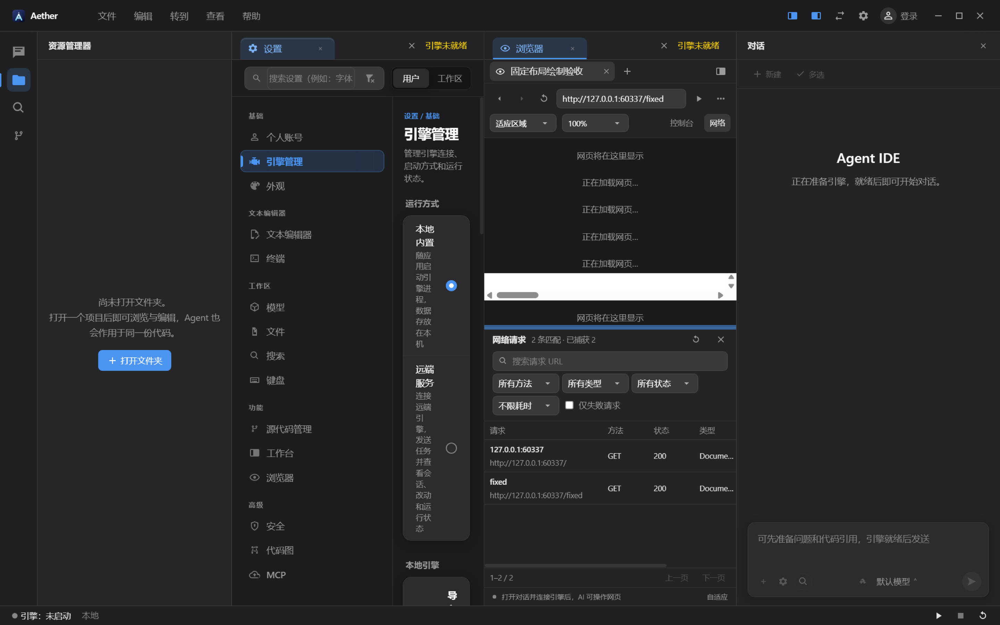
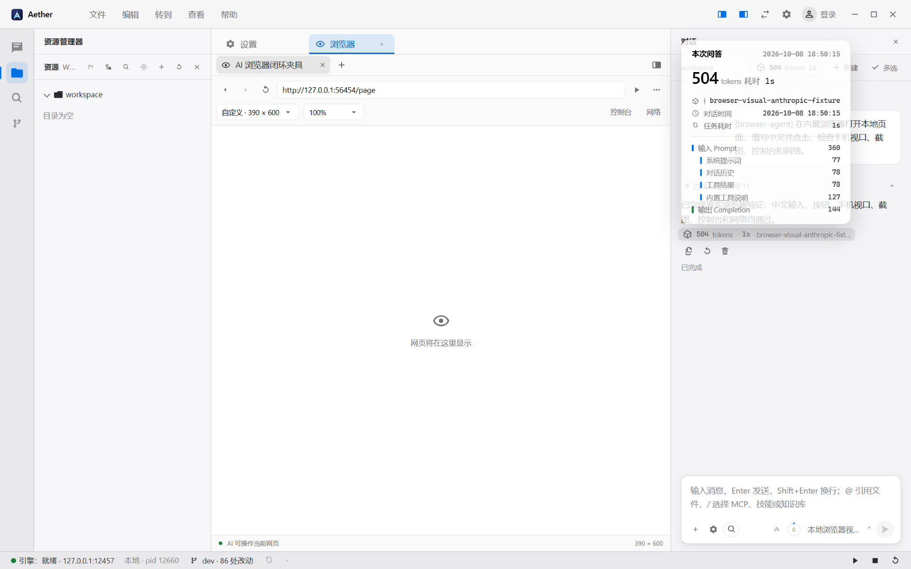
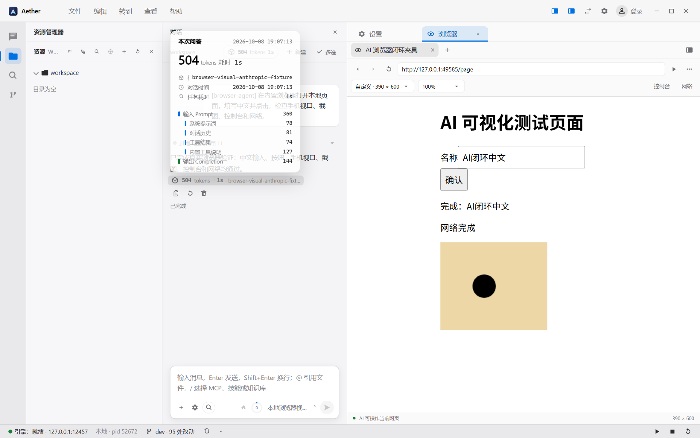
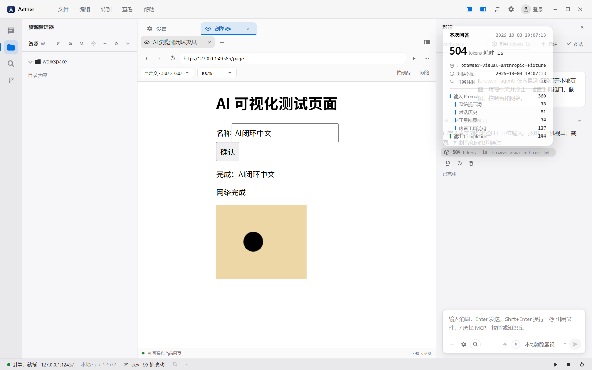
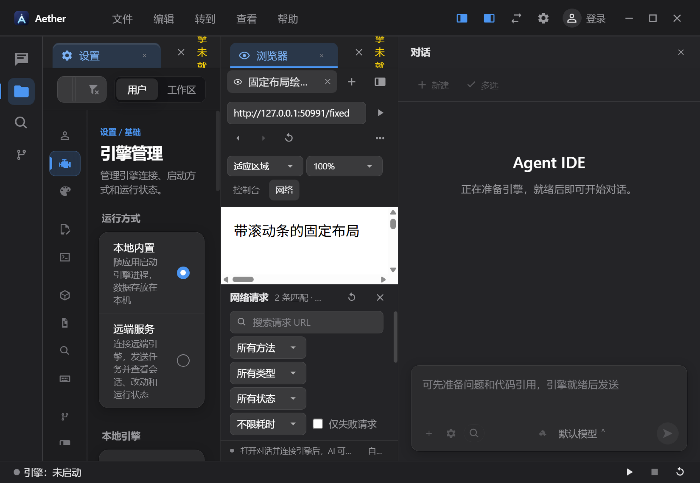
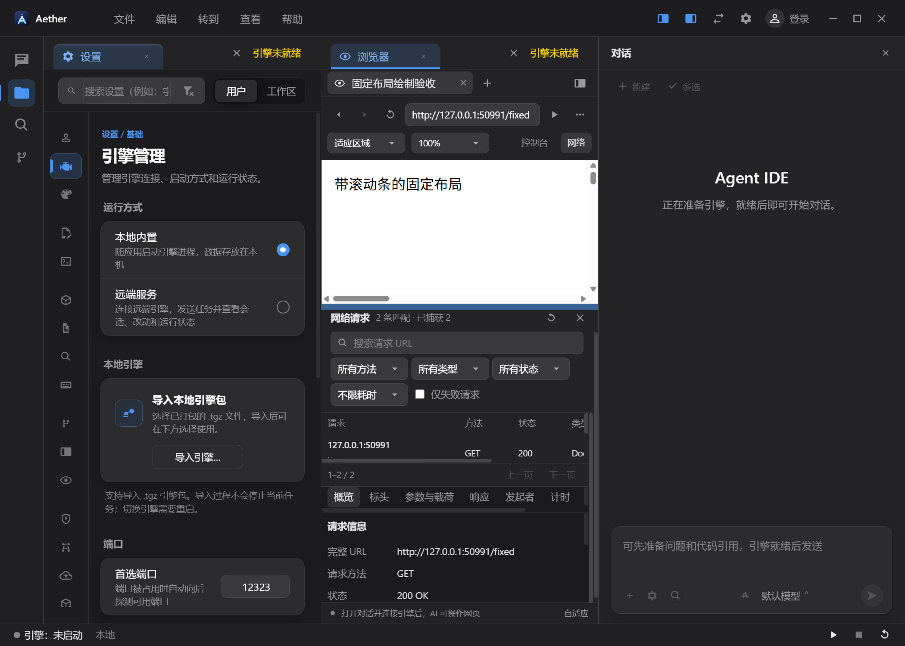

# 浏览器重复占位与浮层误隐藏修复

日期：2026-10-08。对应两种反馈：网络面板打开后出现多行“网页将在这里显示”，以及打开对话用量浮层时网页消失、关闭后恢复。

## 已确认的原因

1. **同级 React key 重复。** `BrowserSurface` 和 `NetworkInspector` 都使用 `tab.tabId` 作为 key。网络面板保持打开时，后续导航/标题/加载状态更新导致协调错误，旧网页容器残留。真实 Electron 测试复现出 **7 个 `.browser-surface`**，实际网页被挤为底部细条，与用户截图一致。修复为分别使用 `surface:${tabId}` 和 `network:${tabId}`。这是 DOM/组件标识错误，不是百度页面内容或 GPU 残影。
2. **把任意浮层当作全局遮挡。** 原逻辑发现任何 `role="dialog"` / 菜单就隐藏原生网页；公共 Popover 的用量浮层也使用这个角色，所以即使它完全位于另一栏也会使网页消失。修复为非模态浮层只在与实际网页区域相交时隐藏；真正的模态对话框和全屏遮罩仍然保护前景交互。投影考虑手机/自定义视口的留白、工作台缩放，不能混用屏幕 DPR。
3. **窄栏高度预算不准确。** 工具栏换行后，网络抽屉按固定空间预算布局，窗口缩小并放大工作台时网页区域可能被压成零高度。抽屉改为根据实际兄弟工具栏与底栏高度计算剩余空间，预留网页区域，空间不足时让网络内容滚动。

## 验证方式

- 修复前先重现失败：重复 DOM 计数为 7；真实对话用量浮层与网页不相交，但 native `getVisible()` 变成 false。
- 通过 `desktopCapturer` 保存整个原生窗口，不仅是 renderer 或网页内部截图；同步断言 DOM 区域与原生 View 边界，并采样网页的实际显示像素。
- 覆盖网络面板保持打开时导航、连续拖动、固定大页面滚动条、深色主题、125% 工作台缩放、连续窗口缩放。
- 使用正式引擎和本地确定性模型服务完成真实对话，再分别把对话放在右侧和左侧打开用量浮层；同时保留命令面板遮挡原生网页的验证。
- 几何纯测试覆盖不相交/相交/边界接触、隐藏和零尺寸、模态遮罩、手机与自定义视口留白、宿主缩放和 DPR 区分。

## 最终验收结果

本轮在 Windows / Electron 真实窗口完成验证：**40 passed / 0 failed / 0 skipped，54.2 秒**。

`npm run build` 通过，包含 Node 与 Web 两段 TypeScript 检查，以及主进程、preload、renderer 构建。构建仅提示现有模块同时被静态和动态导入的分包警告。

| 用例文件 | 通过数 | 覆盖内容 |
|---|---:|---|
| `browser-agent-ui.spec.ts` | 2 | 正式引擎接本地确定性模型服务，真实工具链；左右用量浮层不误隐藏网页 |
| `browser-local-ui.spec.ts` | 3 | 本地 HTML 保存运行、中文模块、快捷键、设置跨重启保留 |
| `browser-native-validation.spec.ts` | 6 | 地址、归属、视口、配置及原生边界校验 |
| `browser-network-collector.spec.ts` | 9 | 筛选分页、重定向、脱敏、正文状态与容量边界 |
| `browser-network-ui.spec.ts` | 5 | 真实请求详情、正文续读、面板交互与 DevTools 切换 |
| `browser-occlusion.spec.ts` | 7 | 浮层相交与模态判断、自定义视口留白、宿主缩放 |
| `browser-surface-ui.spec.ts` | 2 | 连续拖拽、深色主题、125% 缩放、四组窗口尺寸；DOM/原生边界/真实像素 |
| `browser-ui.spec.ts` | 6 | 浏览器入口、工具通道、手机视口、命令面板、取消与销毁 |

构建完成后执行，使用单 worker 和独立输出目录：

```powershell
npx playwright test e2e/browser-surface-ui.spec.ts e2e/browser-occlusion.spec.ts e2e/browser-agent-ui.spec.ts e2e/browser-network-ui.spec.ts e2e/browser-network-collector.spec.ts e2e/browser-ui.spec.ts e2e/browser-local-ui.spec.ts e2e/browser-native-validation.spec.ts --output .e2e-tmp/browser-display-regression-results
```

本轮验收范围是浏览器显示修复及相关浏览器/AI 工具链回归，不等同于整个 IDE 或所有引擎模块的全量测试。模型响应使用本地确定性夹具，不依赖外网模型服务。网络抽屉空间不足时缩小并滚动，网页预留高度为 96 CSS px；窗口小到固定工具栏已占满空间时，不能保证完整显示所有区域。

## 复现证据

修复前，实际窗口中的重复网页容器和被挤压的网页：



修复前，用量浮层导致另一栏网页隐藏：



## 修复后的真实窗口

下列图片来自本轮通过的测试，已人工核对原生网页仍然可见、没有重复占位：

左侧对话打开用量浮层，右侧网页正常显示：



右侧对话打开用量浮层，左侧网页正常显示：



深色主题、125% 工作台缩放和小窗口下，网页仍有显示空间：



连续缩放窗口、拖动网络抽屉后，网页和网络详情正常共存：



## 生效方式

本次修改在客户端。使用新的客户端构建并重启客户端，以清理旧界面已残留的 DOM 并加载更新后的 preload。引擎无需因本次显示修复重新打包。本次没有重启用户运行中的客户端，也没有改动用户模型或会话数据。
