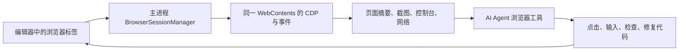

# Aether 内嵌浏览器与 AI 可视化测试技术调研

日期：2026-10-08。范围：官方网络资料、本项目源码、VS Code / Wuzu 本地源码、当前 Electron 的独立可行性验证。本文是选型与实施建议，尚未把浏览器接入产品。

**后续实施状态**：首轮功能已接入并完成真实 Electron / 引擎验证，见 [浏览器接入与验收报告](browser-integration-verification-2026-10-08.md)。下文保留选型时的事实与后续阶段建议，具体已实现范围以验收报告为准。

## 1. 推荐结论

采用 **Electron WebContentsView + 主进程浏览器管理服务 + 受控 CDP 代理 + AI 浏览器工具**。Playwright 放在自动化层，经过当前 Electron 版本的适配验证后接入。

保留 Aether 现有编辑器布局，让浏览器成为可分栏、可拖动、可调整视口的编辑区标签。用户手动操作与 AI 测试使用同一个 `WebContents`，以明确的 `tabId / sessionId / engine identity` 绑定。

优先借鉴 `D:\dev\vscode` 已有的 **integrated browser**，而不是它的 Simple Browser。前者已经实现 WebContentsView、会话 CDP、Playwright 和 AI 工具。Wuzu 主要通过外部 Chrome、扩展及 CDP 工作，适合参考工具体验，但不是本次嵌入控件的首选。

## 2. 当前项目实际情况

- `package.json` 声明 Electron `^39.2.6`，本机实际安装 **39.8.10 / Chromium 142.0.7444.265**。这是本次实测基线；正式支持任意外站前，应核对 Electron 的维护状态并完成受维护版本的升级回归。
- 主进程已有 BrowserWindow；渲染端已有编辑区视图注册、分栏及布局状态，可以接入浏览器标签，无需另起一套工作台。
- 现有 `SourcePreview` 是 iframe 静态预览；`source-preview-document.ts` 会清理脚本等内容。它能展示 HTML，但不能承担完整网页交互测试。
- IDE 渲染页有自己的 preload 和 IPC 能力。浏览器页面必须用单独的 WebContents 与 session，不能把 IDE 的 preload 复用给网页。
- 本项目 Windows 默认关闭硬件加速并使用 `in-process-gpu`。独立探针沿用该策略，中文、Canvas 2D 与截图正常；WebGL、视频、复杂动画仍需单独测量。
- 引擎已有工具注册表和 MCP 接入，但未发现现成的、绑定 Aether 可见页面的浏览器控制服务。

## 3. 技术对比

| 方案 | 网页运行与 AI 控制 | 对 Aether 的适配 | 结论 |
|---|---|---|---|
| **WebContentsView** | 独立 Chromium 页面，导航、会话、DevTools、截图、CDP | 复用已有 Electron；需协调原生视图与 React 的位置、可见性、焦点 | **首选** |
| BrowserView | 能嵌入网页 | Electron 29 起已废弃，由 WebContentsView 替代 | 不用于新实现 |
| Electron `<webview>` | 有独立网页与较多控制能力 | 官方不推荐，架构变化影响稳定性；不能因接入简单就当长期基础 | 不推荐 |
| iframe | 适合受控静态内容 | 跨站受 CSP / frame 限制；跨域 DOM、网络和浏览器会话控制不足 | 保留用于静态预览 |
| WebView2 | 成熟的 Edge WebView 方案 | Windows 生态和额外 Runtime；现有 Electron 内还要加入原生桥与第二套生命周期，跨平台也需另做 | 原生 Windows 重构时再考虑 |
| CEF | 成熟的 Chromium 嵌入框架、原生接口 | 更适合原生宿主；本项目会额外承担构建、桥接、发行和浏览器更新成本 | 本项目无必要 |
| 独立 Chrome / Playwright 浏览器 | 自动化及跨浏览器测试成熟 | 用户看到的 IDE 页面容易与测试页分离；外部窗口嵌入不是 Electron 的现成跨平台控件 | 作为外部兼容性测试补充 |

WebContentsView 提供完整网页运行能力，不等于嵌入了完整 Chrome 产品：地址栏、标签、下载管理、权限界面、会话恢复都需由 Aether 实现。Electron 官方也只支持部分 Chrome 扩展 API，不承诺 Chrome 商店扩展、账户同步等完整兼容。

## 4. 用户体验与调整能力

建议编辑区内有浏览器标签，标签显示网页标题与图标；工具栏提供后退、前进、刷新/停止、地址栏、页面缩放、设备尺寸和检查入口。浏览器标签参与现有左右分栏，不改变整个 IDE 的字号或高度。

需要区分三种调整：

1. **区域尺寸**：用户拖动分栏，改变浏览器在工作台中的占用空间。
2. **网页视口**：例如桌面宽屏、平板、390px 手机、自定义宽高、横竖屏；网页响应式布局按此计算。
3. **显示缩放**：把模拟手机画面适配到当前区域，或调整网页阅读倍率。不能简单把整个 IDE 缩小冒充手机模拟。

默认加载实际项目 dev server；纯静态交付文件通过受工作区约束的本地 HTTP 服务加载，正确提供 MIME、UTF-8、相对资源和 ES module。SPA 的 history fallback、开发代理与 API 转发需要按项目单独设计，普通静态服务不会自动提供这些能力。开发服务器生命周期和端口归属于对应项目任务。不要把引擎的附件下载 URL 当网页运行地址。

可逐步补充页面查找、打开新标签、下载状态、文件上传、弹窗、独立登录环境、清理站点数据、代理、错误页和崩溃恢复。浏览器与 IDE 的颜色可以统一，但网页本身应按站点样式和显式选择的媒体主题呈现。

## 5. AI 如何读取状态并形成自检过程

| AI 需要的信息/操作 | 技术入口 | 设计要求 |
|---|---|---|
| URL、标题、加载/失败/崩溃状态 | webContents 导航与进程事件 | 主进程统一生成状态，避免界面自己猜 |
| 可点击元素、文字、语义、位置 | Accessibility / DOM / DOMSnapshot；适配后可用 Playwright locator / ARIA | 优先语义定位，元素引用绑定当前导航版本 |
| 页面、元素、Canvas 的实际画面 | capturePage / CDP Page 截图 | 截图带尺寸、DPR、滚动和页面身份；视觉模型才能直接理解图像 |
| 控制台与 JS 异常 | Runtime 事件、console-message、pageerror | 返回新增摘要，可按需展开 |
| 请求失败、状态码、耗时 | Network 事件 / Playwright request、response | 默认摘要；响应体与敏感头不批量塞给模型 |
| 点击、输入、滚动、拖动 | CDP Input 或 Playwright action | 操作后等待明确状态/元素/请求结果，不能只等待固定秒数 |
| 响应式、触摸、主题、网络条件 | Electron device emulation 与受控 Emulation / Network | 由同一管理器协调，避免自动化层覆盖用户设备设置 |
| 保存测试证据 | 截图、步骤、断言、日志摘要、测试代码 | 绑定 runId / tabId，报告可复查 |

首批工具建议：`browser_open`、`browser_tabs`、`browser_snapshot`、`browser_screenshot`、`browser_click`、`browser_fill`、`browser_scroll`、`browser_console`、`browser_network`、`browser_set_viewport`。这些是拟定接口，当前尚未注册。

五子棋验收应包含：打开真实页面 → 点击棋盘 → 检查落子与轮次 → 悔棋/重开 → 改手机宽度 → 检查溢出及报错 → 输出前后截图和断言。Canvas 棋子不一定出现在 DOM/ARIA 中，必须配合截图或明确的项目测试接口，不能只凭页面标题出现就宣布成功。

AI 修改代码后由 dev server 热更新或受控刷新，再执行相同验收步骤。用户随时可以接管；AI 动作与用户输入需要协调，避免同时点击导致不可重现。

这能补齐当前“AI 写完但没有实际看页面”的缺口；仍不能替代 Firefox / WebKit 兼容性测试、真实手机、后端契约测试和性能测试。

## 6. 为什么不直接安装 Playwright MCP 就算完成

Playwright 是自动化层，不是嵌入控件。默认启动另一台浏览器会导致 AI 测试的页面与用户看到的页面分离。

官方 `connectOverCDP` 支持连接 Chromium，但明确说明其能力完整度低于 Playwright 原生连接；外部启动参数、浏览器版本会影响部分功能。MCP 提供页面快照、截图、操作、控制台和网络等成熟工具思路，适合借鉴或适配接入。

推荐主进程持有每页 `webContents.debugger`，通过受限代理向工具层暴露指定页面。首先以直接 CDP 的小范围工具验证完整链路；再适配 Playwright 的等待与定位能力。避免开放能操纵所有 IDE 页面/所有标签的通用远程调试端口。

引擎若运行在远端，不能让它直接访问客户端的 `localhost`。需要客户端到引擎的认证工具通道，或按部署模式选择远端浏览器；远端项目的 localhost 预览还需端口转发。这两项必须作为远端模式的独立交付项。

## 7. 可借鉴源码与适配工作

VS Code：

- `D:\dev\vscode\src\vs\platform\browserView\electron-main\browserView.ts`：WebContentsView 创建、会话与窗口归属、隐藏/关闭、导航。
- 同目录 `browserViewDebugger.ts`：`debugger.attach('1.3')`、子 target 归属与多会话 CDP 分发。
- `D:\dev\vscode\src\vs\platform\browserView\node\playwrightService.ts`：按 Agent 会话创建 CDP group，通过定制 transport 接入 Playwright。
- 同目录 `playwrightTab.ts`：标题、URL、弹窗、文件选择器、增量日志和 ARIA 摘要。
- `D:\dev\vscode\src\vs\workbench\contrib\browserView\electron-browser\tools\`：打开、导航、读取、点击、输入、拖动、截图等工具。

这份 VS Code 使用 Electron 42.8.1 与 Playwright 1.61 alpha，并使用定制传输和 AI ARIA 扩展，不能把整套目录复制到 Electron 39 后就认定可用。它还专门处理设备模拟命令可能导致 Electron 崩溃的情况，以及 Playwright 默认模拟参数干扰用户视口的问题。移植应保留必要许可证声明，并将其服务依赖替换成 Aether 自己的 IPC、状态与工具注册机制。

Wuzu：

- `D:\web\wuzu-client\src\main\services\wuzuBrowserExtension.ts`：外部 Chrome 独立 profile、扩展与调试端口。
- `pageAgentMcpServer.ts`：页面观察/操作及 CDP 截图等补充。

可借鉴“观察 → 操作 → 再观察”的交互。其按首个 HTTP target 做兜底的方式不能用于我们的多标签场景，应始终明确页面身份。

## 8. 本机可行性验证与未验证项

在独立测试配置下运行当前 Electron 39.8.10，未调用生产模型，未修改现有产品窗口：

| 项目 | 实测结果 |
|---|---|
| BrowserWindow 中加入 WebContentsView | 成功 |
| 区域宽度 800 → 600 | 成功 |
| 手机视口 390×600、DPR≈2、触摸点 1 | 成功 |
| 读取 Accessibility / DOMSnapshot | 成功，13 个 AX 节点 / 1 个文档 |
| CDP 点击测试按钮，DOM 变为“点击成功” | 成功 |
| 获取 console 日志、测试错误、HTTP 200 请求 | 成功 |
| 中文与 Canvas 2D 截图 | 成功，PNG 22,287 字节 |
| 网页访问 Node require / Aether IPC | 均为 undefined |
| 关闭 WebContents | 已销毁 |

探针发现了两个初始化/可见性条件：新视图需先初始化文档再等待部分 CDP 命令；隐藏视图的真实指针输入未立即产生预期结果，显示视图并等布局帧后通过。因此首次加载、后台标签、截图和输入不能仅靠“对象已创建”判定就绪。此次成功的完整交互探针使用短暂显示的独立窗口。

尚未验证：React 弹层遮挡、跨屏 DPI、复杂分栏拖动、DevTools 与 Agent 同时附加、Playwright 接入当前 Electron、WebGL/视频/下载/登录、远端端口转发与工具反向通道、浏览器长时间内存占用。一次简单页面通过不代表这些兼容性已成立。

## 9. 实施顺序与验收门槛

1. **浏览器容器**：一个真实浏览器标签、地址栏、导航、调整大小、项目 dev server。验收实际五子棋可下棋，分栏无错位，关闭不泄漏。
2. **观察与人工调试**：URL/加载状态、截图、控制台、网络、设备模拟、DevTools。验收日志与当前页一致，高 DPI 点击正确；打开/关闭 DevTools 时处理 debugger 断开与重新附加，废弃旧 CDP 会话和元素引用，通道断开不能报告 AI 操作成功。
3. **AI 同页测试**：会话工具代理、结构化快照、动作等待、用户接管与测试证据。验收 AI 实际发现并修复一个预置交互 bug，修复前后步骤可重放。
4. **稳定性与完整管理**：多标签恢复、下载/上传/权限、远端工作区、资源回收、版本升级。验收用户关闭/切会话/引擎重启时，不控制错误页面、不遗留孤儿进程。

布局建议：React 通过 ResizeObserver 上报浏览器容器矩形，主进程校验并设置原生 view bounds；明确 CSS 像素、窗口缩放与 DIP 的换算。浏览器不是 DOM 元素，普通 CSS z-index 无法保证覆盖它，命令面板/模态框/拖拽遮罩需要显式的原生视图显示与遮挡策略。Electron 39 的网页缩放还存在同源共享行为，不能假设每个标签完全独立。

网页采用独立 session、sandbox、contextIsolation、关闭 Node 和 IDE preload；AI 仅能取得分配给当前任务的页面句柄。主进程验证 IPC 来源和操作参数；Cookie/令牌不进入自动日志。这里的隔离是实现架构的一部分，不要求每次读取或点击都弹确认。

## 10. 网络资料

以下官方页面在本次调研中实际联网读取。搜索结果仅作入口，结论以文档及源码为准；latest 页面可能介绍高于 Electron 39 的 API，已交叉核对版本源码和安装包类型。

1. [Electron Web Embeds：iframe、webview、WebContentsView 对比](https://www.electronjs.org/docs/latest/tutorial/web-embeds)
2. [Electron WebContentsView](https://www.electronjs.org/docs/latest/api/web-contents-view)
3. [BrowserView 弃用说明](https://www.electronjs.org/docs/latest/api/browser-view)
4. [Electron debugger / CDP](https://www.electronjs.org/docs/latest/api/debugger)
5. [webContents：截图、输入、设备模拟、导航](https://www.electronjs.org/docs/latest/api/web-contents)
6. [BaseWindow 资源管理：子 WebContents 需显式关闭](https://www.electronjs.org/docs/latest/api/base-window)
7. [Electron session：分区、权限、代理](https://www.electronjs.org/docs/latest/api/session)
8. [Electron 安全配置](https://www.electronjs.org/docs/latest/tutorial/security)
9. [Playwright connectOverCDP 的能力边界](https://playwright.dev/docs/api/class-browsertype#browser-type-connect-over-cdp)
10. [Playwright Electron 自动化仍标为实验性](https://playwright.dev/docs/api/class-electron)
11. [Microsoft Playwright MCP](https://github.com/microsoft/playwright-mcp)
12. [CDP Accessibility](https://chromedevtools.github.io/devtools-protocol/tot/Accessibility/)、[DOMSnapshot](https://chromedevtools.github.io/devtools-protocol/tot/DOMSnapshot/)、[Emulation](https://chromedevtools.github.io/devtools-protocol/tot/Emulation/)
13. [WebView2](https://learn.microsoft.com/en-us/microsoft-edge/webview2/)、[Runtime 分发](https://learn.microsoft.com/en-us/microsoft-edge/webview2/concepts/distribution)
14. [Chromium Embedded Framework](https://github.com/chromiumembedded/cef)
15. [Electron Chrome 扩展支持范围](https://www.electronjs.org/docs/latest/api/extensions)
16. [VS Code Integrated Browser](https://code.visualstudio.com/docs/debugtest/integrated-browser)
17. [Electron 39.2.6 WebContentsView 版本源码文档](https://github.com/electron/electron/blob/v39.2.6/docs/api/web-contents-view.md)
