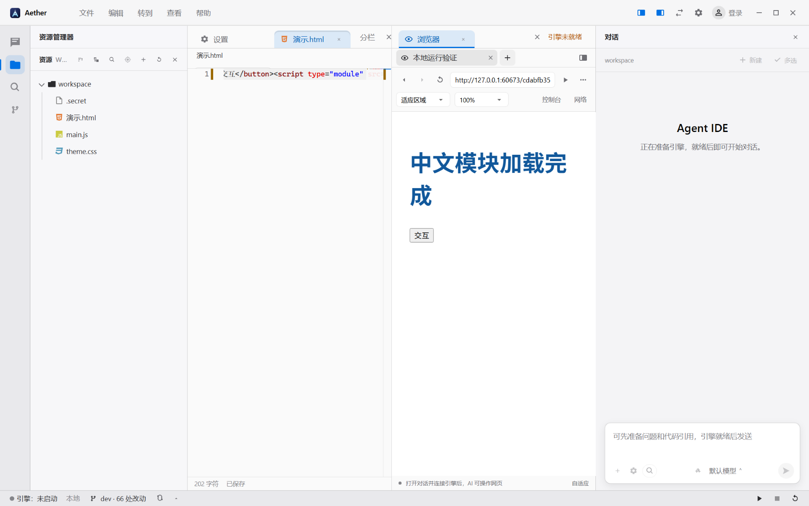
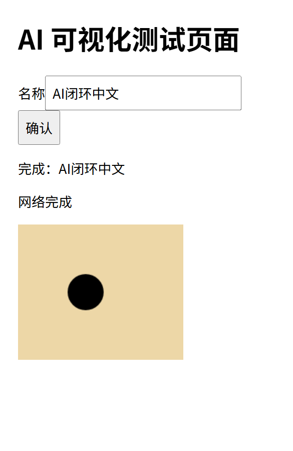

# 内置浏览器接入与验收报告

日期：2026-10-08。客户端：`D:\dev\aether-code`；配套引擎：`D:\dev\ai-agent-engine`。

本次已把真实 Chromium 页面接入 Aether 的现有编辑区，并打通设置、HTML 保存运行和 AI 同页操作。用户看到的网页与 AI 工具操作的网页是同一个 WebContents。

## 1. 如何使用

1. 按 **Ctrl+Alt+B** 在右侧打开浏览器，也可以从 **查看** 菜单或命令面板执行“打开内置浏览器”。拖动现有分栏分隔线调整区域。
2. 输入项目开发服务地址，例如 `http://localhost:5173`。本地 HTML 文件可以直接点击编辑器工具栏的 **运行**，它会先保存未保存内容，再在右侧浏览器执行。
3. **设置 → 浏览器** 提供默认地址、默认缩放、默认视口、保留网页登录状态、允许 AI 操作和清除站点数据。浏览器更多菜单也有设置与开发者工具入口。
4. 工具栏可切换自适应、桌面、手机或自定义尺寸，打开控制台/网络抽屉。网页地址栏支持 Ctrl+L，网页刷新支持 Ctrl+R，新建/关闭网页支持 Ctrl+T / Ctrl+W。
5. 连接配套引擎并进入 Code 会话后，浏览器底部会显示 AI 连接状态。已有页面需要重新分配时，点击 **交给当前会话**。

可直接向 AI 发送：

> 用内置浏览器打开 http://localhost:5173，检查页面按钮和表单，切到手机宽度测试，读取控制台与失败请求，截图确认结果；发现问题后修复并重复验证。

AI 工具由引擎自动提供，不需要用户另装浏览器 MCP。截图视觉分析需要模型配置声明并实际支持图片输入。

## 2. 已实现范围

| 维度 | 本次实现 |
|---|---|
| 网页容器 | Electron WebContentsView，独立浏览器 session、真实脚本/Canvas/网络运行 |
| 编辑器集成 | 固定浏览器视图、多网页标签、右侧分栏、原生焦点同步、快捷入口 |
| 导航 | URL、标题、后退/前进、刷新/停止、错误状态、新建和关闭网页 |
| 显示 | 阅读缩放、自适应/手机/桌面/自定义视口，真实尺寸标签 |
| 调试 | 控制台与请求摘要、实际 PNG 截图、DevTools 入口 |
| 设置 | 默认地址/缩放/视口、登录存储开关、AI 开关、清除数据，重启保留 |
| 本地 HTML | 保存后通过临时 HTTP 运行，UTF-8、ES module、相对和根相对资源，支持 `.ae/brainstorm` 与 `.ae/tmp` 产物 |
| AI 工具 | 14 个内置工具，绑定引擎与根会话，子代理继承根会话归属 |
| 远端引擎 | 客户端主动建立认证长轮询，远端工具可操作客户端可见页面 |
| 生命周期 | 关闭销毁网页，切会话/引擎/禁用 AI 取消旧动作，断线重连、租约回收 |

14 个工具：`browser_open`、`browser_tabs`、`browser_navigate`、`browser_snapshot`、`browser_screenshot`、`browser_click`、`browser_fill`、`browser_scroll`、`browser_press_key`、`browser_wait`、`browser_console`、`browser_network`、`browser_set_viewport`、`browser_close`。

观察快照提供文字、语义元素、元素引用、普通输入值、当前页面版本和视口。密码/验证码输入值不进入结构化快照。输入动作需要当前页面版本；导航之后的旧引用会失败并要求重新观察。工具失败会返回实际错误。

## 3. 前后端链路

```text
Code Agent → 引擎浏览器工具 → 按租户/用户/根会话隔离的命令队列
           ↑                         ↓ 客户端认证长轮询
模型图片/工具结果 ← 主进程浏览器桥 ← BrowserService / WebContentsView
                                      ↕
                             编辑区浏览器与用户操作
```

- Renderer 通过受限 preload IPC 调用主进程；网页没有 Node、IDE preload 或 `window.aether`。
- 主进程管理视图、会话、CDP、截图和网络事件。只接受所属 IDE 主 frame 的 IPC。
- 浏览器几何使用编辑区 CSS 坐标乘 IDE zoom 转成原生 DIP，避免重复乘屏幕 DPR；命令面板/菜单/对话框出现时隐藏原生页面，避免遮挡。
- 工具通道使用正常引擎认证与独立浏览器令牌。每次请求刷新账号凭据并复核目标身份；注销旧连接时仍使用旧连接信息。
- 引擎不需反向访问客户端 localhost，也不开放通用远程调试端口。命令有超时、取消和页面归属检查。
- 截图经引擎图像适配器转换为真正的模型图片块，并保留 tabId、navigationId、CSS 视口和截图尺寸说明。
- 本地 HTML 服务限制工作区真实路径，过滤隐藏配置文件和越界链接；随机 URL 与 HttpOnly Cookie 用于初次加载及根路径资源。并发打开同一工作区共用一个服务，窗口关闭时回收。

主要客户端位置：`src/main/browser/`、`src/main/browser-{bridge,ipc,preview}.ts`、`src/shared/browser*.ts`、`src/renderer/src/contrib/browser/`、`src/renderer/src/core/browser/connection.ts`。

## 4. 验证结果

| 层级 | 最终结果 | 实际覆盖 |
|---|---:|---|
| 客户端 node / web 类型检查及生产构建 | 通过 | 主进程、preload、React 完整产物 |
| 浏览器专项 | **16 passed** | 4 个 spec；真实页面、真实输入点击、设置、原生边界、关闭/取消、本地产物、完整 AI 链路 |
| 关联客户端回归 | **24 passed** | 编辑组 6、源码预览 5、引擎来源隔离 9、交付链接 4 |
| 原生窗口视觉补验 | **3 passed** | 重跑本地浏览器 spec，额外取得包含 WebContentsView 的原生窗口截图 |
| 引擎相关回归 | **147 passed** | 9 个 spec；浏览器服务/路由/工具、Code profile、子代理边界、模型图片、流式与 EMPTY_OUTPUT 回归 |
| UI 静态检查 | 通过 | 新浏览器目录 ESLint、主题令牌检查；深浅色复用现有语义令牌 |

客户端主轮为 **40 passed / 0 failed / 0 skipped，51.1 秒**。视觉补验是其中 3 条的重复运行，不重复算新增覆盖。本报告不是对全仓库所有用例或全部第三方网站的通过声明。

真实 AI 验收使用正式引擎和本地确定性 Anthropic SSE 测试服务，未使用用户模型密钥，也未产生付费模型调用。测试实际执行：

```text
browser_open → snapshot → fill（中文与元素 ref）→ click
→ wait（真实请求完成）→ set_viewport（390×600）
→ screenshot（真实 PNG 图片块）→ console → network → 最终回复
```

断言包括页面真实 DOM/输入值、恰好一次 HTTP 请求、实际页面宽度、模型收到 PNG 图片块及页面身份、工具历史各一条、最终 run succeeded。它验证了集成通路，不等于验证所有模型自主规划与视觉判断质量。

本地专项还验证 HTML 点击运行前真正落盘、中文模块执行、根路径 CSS 生效、隐藏文件/越界读取被拒、`.ae` 产物可运行、快捷键焦点、125% IDE 缩放下原生区域对齐、设置重启保留。

在验收中修复了：设置缓存过期；连接凭据不刷新；会话切换后旧动作继续等待；普通输入值被过度过滤；自定义尺寸误显示预设名称；产物点目录被过滤；根路径资源 404；静态服务并发与关闭竞态。

复跑客户端：

```powershell
npm run build
npx playwright test e2e/browser-native-validation.spec.ts e2e/browser-ui.spec.ts e2e/browser-local-ui.spec.ts e2e/browser-agent-ui.spec.ts e2e/editor-groups.spec.ts e2e/editor-source-preview.spec.ts e2e/engine-source-isolation.spec.ts e2e/chat-artifact-link-ui.spec.ts
```

引擎验证：

```powershell
npx vitest run src/tools/browser/__tests__ src/api/http/routes/__tests__/browser-routes.test.ts src/tools/__tests__/tool-profile.test.ts src/core/agent-loop/__tests__/react.test.ts src/core/llm-adapter/__tests__/anthropic-stream.test.ts src/tools/subagent/__tests__/subagent-tool.test.ts src/api/http/routes/__tests__/tool-profile-routes.test.ts --maxWorkers=1 --minWorkers=1
npx vitest run src/core/agent-loop/__tests__/react-streaming-context.test.ts --maxWorkers=1 --minWorkers=1
```

## 5. 使用新版构建

客户端 `out/` 和引擎 `dist/` 已构建。开发模式默认读取同级 `ai-agent-engine/dist/main.js`；重启客户端和配套引擎后生效。

**显式选择的已导入引擎优先级更高**。如果设置中仍选中以前的导入包，需要切回开发配套引擎，或重新打包、导入包含此次改动的新引擎。已运行的旧进程、旧 tgz、已安装客户端不会自动变成新版本。本次没有替换用户的正在运行实例或生产配置。

最终引擎 buildId：`sha256:f8dc8582ee45729fbf09d9f3e80dc2e0f7e079f8d7892a8a033d2e072b280587`。

## 6. 本次边界

- 远端引擎工具通道已接通；远端开发服务仍需提供本机可访问地址，自动 SSH/远端端口转发尚未接入。
- 静态 HTML 服务不提供 SPA history fallback、后端代理或自动 dev server 生命周期；应用项目使用自身开发服务器。
- AI 页面输入要求对应页面当前可见；后台标签不会被悄悄点击。切回页面或重新打开后再操作。
- 已有网页登录状态可持久化，打开的标签列表尚未实现跨应用重启恢复。
- 下载使用原生保存入口；完整下载管理、浏览器扩展/Chrome 同步、代理设置、完整权限管理尚未实现。
- 新窗口打开为受控标签，不保留 `window.opener`；复杂 OAuth 弹窗、上传、多屏 DPI、长时间内存、WebGL/视频及各类第三方站点仍需专项验收。
- 当前基于项目既有 Electron 39。浏览器版本升级及跨 Firefox/WebKit 的兼容性测试属于后续工作。

## 7. 实际截图

以下均来自隔离测试应用。第一张通过原生窗口捕获得到，包含真正的嵌入网页；第二张是浏览器工具发送给模型的实际页面 PNG。




