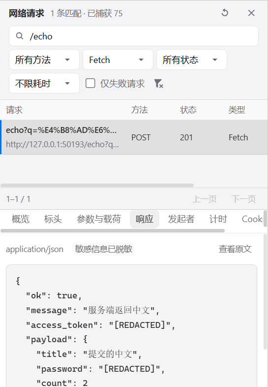
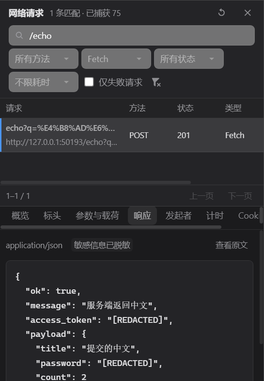

# 浏览器网络详情接入与验收

日期：2026-10-08。客户端：`D:\dev\aether-code`；配套引擎：`D:\dev\ai-agent-engine`。

## 需求与结果

旧网络面板只列出 URL、状态和耗时，AI 也只能读取摘要，无法据此核实接口的参数、响应或错误原因。本次采用同一份 Chromium 网络采集数据，打通界面与 AI 的“先筛选列表，再按请求 ID 读取详情，再按游标续读正文”。

## 界面操作

打开内置浏览器（Ctrl+Alt+B），访问项目地址，点击工具栏的“网络”。

- 支持 URL、请求方法、资源类型、状态、仅失败请求和最短耗时筛选。筛选先于分页，每页 50 条。
- 列表展示请求名称、地址、方法、状态、类型、耗时和传输大小。点击某条请求显示详情。
- 详情包括概览、标头、参数与载荷、响应、发起者、计时、Cookie；可以沿重定向链查看前后请求。
- 文本响应支持 JSON 格式化和原文切换、分段加载；等待中、无正文、二进制、正文不可用和超出捕获范围分别显示原因。
- 面板可拖动或用键盘调整高度，窄分栏上下排列；使用现有主题令牌与公共选择组件。

## AI 工具

新增 `browser_network_request`，浏览器工具总数由 14 个增至 15 个。下面的 ID 必须来自前一个工具的实际结果，不能猜测。

```text
browser_network({
  tabId,
  query: { url: "/api/", resourceType: "Fetch", failedOnly: true, limit: 20 }
})

browser_network_request({
  tabId, requestId: entries[0].id,
  bodyTarget: "response", bodyOffset: 0, bodyLimit: 12000
})

// response.body.hasMore 为 true 时，用返回的 nextOffset 继续读取。
browser_network_request({
  tabId, requestId,
  bodyTarget: "response", bodyOffset: response.body.nextOffset, bodyLimit: 12000
})
```

列表支持 `url`、`method`、`resourceType`、`status`、`failedOnly`、`minDurationMs`、`offset`、`limit`。状态可以是精确状态码、`1xx`–`5xx`、`failed` 或 `pending`。读取请求载荷使用 `bodyTarget: "request"`。

详情返回请求/响应标头、查询参数、Cookie 名称、请求/响应正文、HTTP 协议、远程地址、缓存/Service Worker 标记、发起者调用栈、时序与重定向关系。Chromium 没有提供的字段不会补造。网络读取工具可用于 Code 会话和只读研究子代理，仍遵守标签与根会话归属检查。

## 数据完整性与边界

- 每条请求使用独立公共 ID，重定向的每一跳具有各自 ID；CDP 复用 ID 不会把后一跳正文错误归给前一跳。
- 请求/响应的 ExtraInfo 会与对应请求合并，覆盖比普通事件更完整的实际标头；乱序到达有专门测试。
- Authorization、Cookie 值及按名称识别的 token/password 等字段在缓存和分页前脱敏，普通业务字段保留。脱敏基于规则，并不等于识别任意自定义秘密格式。
- 列表保留最近 500 条记录，返回累计捕获数、匹配数、移出数量与分页游标。正文默认每次 12,000 字符，最大 60,000；另一方向仅提供短预览。单正文与缓存有明确预算，超限或回收会标记，不伪装成完整数据。
- 引擎会在工具输出预算内保持 JSON 结构，并同步调整正文游标、列表页游标与警告，防止通用字符串截断破坏模型收到的 JSON。Code 模式默认预算为 65,536 个 UTF-16 单元；超预算时原警告最多保留 8 条、每条 512 字符，并附上预算压缩提示。
- 打开原生 DevTools 时，内置采集按暂停处理。已捕获的标头与已缓存正文仍可查看，未缓存正文返回原因；关闭 DevTools 后恢复，暂停期间可能漏采的提示继续保留。
- 此次未实现 WebSocket 握手/消息帧、SSE 实时消息体、请求编辑重放、HAR 导出、限速与离线模拟。不能把当前能力等同于完整 Chrome DevTools。

## 验收中发现并修复的问题

真实窗口测试发现，标签创建事件早于初始页面和网络采集器就绪。用户立即在地址栏导航可能打断初始化：页面已请求成功，网络捕获数却为 0，并留下 ERR_ABORTED。修复将早到的页面操作等待初始化完成，同时保留关闭与初始化失败的明确处理。这不是通过延迟测试掩盖问题。

另一个真实 Chromium 差异是 204 无内容响应后可能收到 `Network.loadingFailed / net::ERR_ABORTED`。现在已收到无正文 HTTP 响应时，正文状态仍为 `empty`，同时保留传输错误及解释警告；普通 200 响应被中断仍为 `unavailable`，不会隐藏真正失败。

## 验证结果

| 检查 | 最终结果 | 覆盖 |
|---|---:|---|
| 客户端类型检查与生产构建 | 通过 | node + web，Electron 主进程、preload、renderer |
| 客户端浏览器专项 | **30 passed / 0 failed / 0 skipped** | 6 个 spec，26.6 秒 |
| 引擎专项 | **181 passed / 0 failed** | 10 个 spec，浏览器工具、桥、路由、Code profile、子代理、ReAct 与模型适配 |
| 引擎类型检查与生产构建 | 通过 | 本次网络工具与结构化输出预算 |
| 静态检查 | 0 errors | 浏览器 UI ESLint 通过；扩展检查 shared/IPC 时有 38 条 Prettier 格式警告 |
| 视觉检查 | 通过 | 实际深浅色网络面板截图、窄栏内容、缩至 200px 后详情仍可达 |

客户端 30 条中，网络纯逻辑 9 条、真实网络/UI 5 条、真实 AI 链路 1 条、现有浏览器 UI 6 条、本地运行 3 条、原生参数/隔离检查 6 条。包括：

- 65 条真实请求跨页无重复，先筛选后分页，URL/方法/类型/状态/失败/耗时过滤。
- POST 中文参数与载荷、实际标头与 Cookie 名称、JSON 响应、压缩中文正文连续读取、调用栈与时序。
- 重定向双向关联、二进制、204 空响应、等待中、网络断开、跨标签 ID 拒绝。
- 详情标签切换、刷新保留选中标签与已加载正文、深浅主题、慢请求筛选、面板高度调整。
- DevTools 占用时缓存仍可读、未缓存正文说明原因、关闭后新请求继续采集。
- 正式引擎通过本地确定性 Anthropic SSE 测试服务完成完整工具调用：打开、快照、输入、点击、等待、切视口、截图、控制台、网络列表、详情及续读，最终会话成功。

AI 验证断言模型收到的详情 JSON 可解析、请求 ID 来自列表、正文两页拼接回预期业务 JSON、测试敏感字段已脱敏，并验证实际网页 HTTP/DOM 副作用。未使用用户模型密钥或付费模型调用；这是集成链路验收，不是所有真实模型自主判断能力或全仓库所有测试的通过声明。

构建有既有 Monaco/GitDiffView 静态/动态混合导入提示，不影响此次构建完成。

客户端复跑（工作目录 `D:\dev\aether-code`，仅单进程、单 worker）：

```powershell
npm run build
npx playwright test e2e/browser-network-ui.spec.ts e2e/browser-network-collector.spec.ts e2e/browser-agent-ui.spec.ts e2e/browser-ui.spec.ts e2e/browser-local-ui.spec.ts e2e/browser-native-validation.spec.ts
```

引擎复跑（工作目录 `D:\dev\ai-agent-engine`）：

```powershell
npx vitest run src/tools/browser/__tests__ src/api/http/routes/__tests__/browser-routes.test.ts src/tools/__tests__/tool-profile.test.ts src/core/agent-loop/__tests__/react.test.ts src/core/agent-loop/__tests__/react-streaming-context.test.ts src/core/llm-adapter/__tests__/anthropic-stream.test.ts src/tools/subagent/__tests__/subagent-tool.test.ts src/api/http/routes/__tests__/tool-profile-routes.test.ts --maxWorkers=1 --minWorkers=1
```

本次引擎 buildId：`sha256:553d2d4b4bd5fbbb624f265083660133b2f05c4ec224617f7f469abe1956a2a4`。

## 使用新版本

客户端与引擎需要一起更新。开发模式使用本次客户端 `out/` 和同级引擎 `dist/`；正在运行的旧进程需重启。若设置中显式选择了以前导入的引擎包，应重新打包导入新版或切换至配套开发引擎。本次没有重启用户实例或改动其生产模型配置。

本报告补充 [原浏览器接入报告](browser-integration-verification-2026-10-08.md)，原报告的工具数量与构建 ID 属于此前验收记录。

## 实际界面截图

来自隔离 Electron 测试窗口，显示真实接口的中文业务响应和敏感字段脱敏结果。




