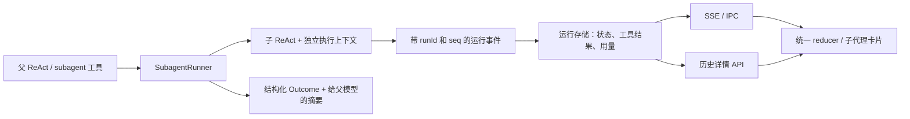

# Aether 子代理：对照调研与实施方案

日期：2026-09-29。状态：**方案，尚未实施业务改动**。本次只读调查三个本地工程/产物及用户提供的失败会话，执行离线验证，产出本文与三份证据报告。

建议保留现有多模型 ReAct 引擎，引入独立的 `SubagentRunner`、持久化任务状态和统一的子任务事件契约。先交付正确执行、可信状态与历史隔离，再完成实时/回放一致、取消和资源限制；后台、续跑、fork/worktree 作为后续能力。

修正 `run(task)` 是必要的第一步。完成整个子代理修复，还需要把任务身份、运行状态、历史、工作目录和权限连接起来。

## 1. 调研范围与证据边界

| 对象 | 本次实际查看 | 能确认什么 |
| --- | --- | --- |
| `D:/dev/aether-code` | React 卡片、SSE/IPC、聊天 reducer、历史回放、用量汇总、E2E 配置 | 当前 IDE 如何显示与恢复子代理 |
| `D:/dev/ai-agent-engine` | subagent 工具、ReAct、provider adapter、session/JSONL/SQLite、工作区、权限、取消和工具池 | 故障调用链与缺失的运行契约 |
| `D:/web/wuzu-client` | Claude SDK provider、共享类型、reducer、Vue 卡片、子转录读取、取消；另辨明 lobster/Codex 分支 | Wuzu 宿主如何消费 runtime 事件、把子过程挂回父卡片 |
| 指定 Claude `2.1.266` 安装 | package/type declarations、launcher、原生 `claude.exe` 中有限可读打包代码 | 该版本的 Agent 输入/输出、任务身份、状态、停止与转录机制 |
| Wuzu 内的 Claude Agent SDK | 实际安装 `0.3.258`，声明 `claudeCodeVersion: 2.1.258` | 补充宿主事件和控制接口；不能当作 2.1.266 全量实现 |

Claude 的 launcher 不是 Agent 实现；实际执行文件是约 219 MB 的原生包。本次没有完整还原其源码，也没有启动 CLI/调用真实模型验证所有分支。二进制证据用版本、文件和字节偏移定位，功能开关相关行为保留此限制。

详细证据：

- [Aether 引擎审计](./engine-audit.md)：11 类缺陷/设计缺失、代码定位及测试建议。
- [Wuzu 宿主实现](./wuzu-reference.md)：事件、ID、卡片、回放、停止、用量及其自身缺口。
- [Claude 本地产物](./claude-reference.md)：同版本工具类型、原生包偏移、SDK 版本边界。

## 2. 截图中的问题分别发生在哪里

| 用户看到的现象 | 已确认原因 | 修复层 |
| --- | --- | --- |
| 两次子代理立即 400 | subagent 把 `[{role, content}]` 传给接收单条 content 的 ReAct；生成了嵌套 user 消息 | Runner 输入和 provider 边界 |
| 失败却标“成功” | ReAct 将异常变成普通文本；subagent 把非空文本当成功；IDE 收到 end 再统一写 done | 运行结果、工具结果和 UI 三层 |
| 左侧多出两个“未命名会话” | 子会话与 root 同层列出，JSONL 硬写 `isSidechain:false`；数组 content 又不能生成标题 | 会话模型与列表查询 |
| 卡片只有任务，没有执行详情 | 本次首请求就失败，确实没有子工具步骤；但错误也被 meta 展示条件隐藏。另有独立缺陷：内层事件不实时转发、摘要落盘前被剥离，成功任务也会丢回放详情 | 错误展示、事件与持久化 |
| 子历史只有一条任务 | 首次 LLM 请求即失败，错误没有形成可恢复的 child terminal record | 任务生命周期 |
| 委派中把 IDE 项目说成 Aether Engine | 项目上下文按引擎 `process.cwd()` 读取 AE.md；工作区也优先返回会话沙箱 | 项目上下文与 cwd。选址错误已证实，模型该次误认的全部因果未单独复现 |
| 230.5k tokens | 该轮落盘的 21 次主模型调用用量合计为 **230525** | 这是记录中的累计值；不能据此断言子代理单次消耗 230k，也不等于当前上下文长度 |

两轮用户提供的失败记录均已找到。第二轮父会话 `a30085bd-cdee-475d-b9b3-42f4d63b351f` 的两个 child 都只有一条 user、content 为数组、`isSidechain:false`，父工具结果包含“✅ 执行完成”与 400 错误；父结果不含子摘要 marker。与截图一致。

主要定位：

- [错误入参](D:/dev/ai-agent-engine/src/tools/subagent/subagent-tool.ts:335)、[ReAct 包装](D:/dev/ai-agent-engine/src/core/agent-loop/react.ts:214)。
- [异常文本化](D:/dev/ai-agent-engine/src/core/agent-loop/react.ts:496)、[非空即成功](D:/dev/ai-agent-engine/src/tools/subagent/subagent-tool.ts:424)。
- [JSONL append](D:/dev/ai-agent-engine/src/storage/conversation/jsonl-history.ts:341)、[列表扫描](D:/dev/ai-agent-engine/src/storage/conversation/jsonl-history.ts:685)。
- [摘要剥离后落库](D:/dev/ai-agent-engine/src/core/agent-loop/react.ts:923)、[前端无条件 done](D:/dev/aether-code/src/renderer/src/core/engine/useChat.ts:1239)、[详情依赖 meta](D:/dev/aether-code/src/renderer/src/contrib/chat/SubagentCard.tsx:169)。
- [工作区排序](D:/dev/ai-agent-engine/src/workspace/manager.ts:16)、[项目上下文选址](D:/dev/ai-agent-engine/src/core/project-context.ts:35)。

**不能只隐藏“未命名”标题。** 修正 task 字符串后，子任务会有标题，但仍会污染主列表。也不能在 UI 里补一条“失败”正则后结束：历史、取消与父模型看到的结果仍然会错。

## 3. Wuzu 与 Claude 实际如何分工

Claude 提供子代理执行、独立上下文、任务状态、控制和转录。Wuzu 通过 SDK 启动/消费它，负责协议适配、父子事件归属、UI 与历史回填。

| 机制 | Claude / Wuzu 的实现证据 | Aether 采用的机制 |
| --- | --- | --- |
| 任务输入 | 2.1.266 `AgentInput` 的 `prompt` 是字符串，runtime 校验 schema | task 内容类型明确，只在 loop 内构造一次 user message |
| 身份 | session、agent/task、spawn tool-use 各有用途；同一 agent 可续跑多轮 | `runId` 标识一次执行，`childSessionId` 标识上下文，`parentToolCallId` 标识父卡片 |
| 启动与完成 | AgentOutput 区分 completed / async_launched / remote_launched | 接收任务、任务终态、父工具完成分开表达 |
| 实时进度 | SDK `task_*`、`parent_tool_use_id`；Wuzu 路由到 `subagentTasks[toolUseId]` | 每个 child 事件带归属与 seq，不混入主回答正文 |
| 历史 | 子转录位于父 session 下 subagents 目录；meta.toolUseId 回填父卡片 | 独立 transcript，持久化父子关系；root-only 列表 |
| 停止 | stopTask 控制 child；等待 stopped 通知，避免关闭父 Query | child AbortController + 资源清理 + 确认终态 |
| 乱序 | Wuzu 终态不会被迟到 running 复活，统计可补齐 | 按 runId/seq 幂等合并；终态不可回退 |
| UI | 目标、步骤、输出、统计各自显示；无统计也可展示输出 | 错误独立展示，live/replay/export 使用同一状态来源 |

Wuzu 的 CLI 卡片与 lobster 群聊式 `AgentSubagentGroup` 是两条实现链；当前本地 Codex adapter 也没有等量的 collab item 专用适配。因此本方案引用的是 **Wuzu 的 Claude 路径**，不能泛化成 Wuzu 所有引擎都已支持这些行为。

同样，参考实现存在值得避开的缺口：Wuzu 回放时用悬挂工具推断任务终态，零工具 LLM 失败可能无法精确恢复；部分迟到结果仍依赖 streaming message；独立 task error 可能只有红点没有文案。Claude 某些部分结果装在 completed 容器里，SDK success subtype 也可能同时 `is_error:true`。新契约应明确终态及原因。

## 4. 选定的目标结构



### 4.1 输入、执行环境与终态

`subagent` 工具保持对模型友好的入口：`task`、可选简短 `description`、研究角色、可选 model、受限制的 maxSteps。调用改成 `run(task, childContext)`；`MessageContent` 收紧成字符串或合法内容块联合，并在运行时拒绝嵌套 Message 数组。合法图片内容块保留。

新增不可变 `ExecutionContextSnapshot`：

- `projectRoot / cwd / workspaceRoots / scratchDir` 分开；当前 IDE 项目是相对路径基准，任务沙箱用于内部产物。
- 项目 AE.md/工程约定从实际项目路径解析，父子共享同一项目来源说明；全局用户说明单列。
- 同模型继承已解析的 provider/endpoint/header/能力；换模型时走统一 resolver 重算。凭证只用内存引用，运行记录保存非敏感配置标识。
- 子权限及工具集合是父允许范围与角色允许范围的交集。研究角色明确只读；子任务无用户交互能力时，不暴露 ask_user 等工具，需要授权返回 blocked。
- 当前工具 ID 是调用级字段，禁止在多任务共享 ctx 上反复覆写；每个 child 独立 signal、history、预算记账与资源释放句柄。

建议状态集合：`queued → running → succeeded / failed / cancelled / blocked / interrupted`；停止请求增加中间态 `cancelling`。这里的 blocked 是首期无法自行处理审批的终态；未来支持审批续跑时再增加非终态 `waiting_for_approval`。

`RunOutcome` 是判别联合。只有正常生成完整最终结果才 succeeded；HTTP 错误、超过步数/额度、超时不能由正文非空转成功。失败和取消可带 `partialOutput`，并保留 `stopReason`、结构化 error、`retryable`。400 请求格式错误立即失败；429/短暂服务错误只在可安全重试的阶段有界重试，例如尚未向上交付 delta、尚未提交工具副作用时。已经产生部分流/副作用时停止并保留部分结果，后续恢复另建执行记录，不能自动重放整个任务。重复派发同一非重试型错误不会通过“缩短描述”消除。

父任务可以处理子失败后继续工作；父最终成功与 child failed 并存。一次内部工具失败也不必直接判整个 child 失败——它可以自行纠正，最终状态由 runner 的 outcome 决定。

### 4.2 身份与存储

一次执行的关键字段建议如下（概念契约，字段名可在实施时统一）：

```ts
interface SubagentRun {
  schemaVersion: 1
  runId: string
  tenantId: string
  rootSessionId: string
  parentSessionId: string
  parentConversationId: string
  parentMessageId: string
  parentToolCallId: string
  childSessionId: string
  task: string
  description: string
  modelId: string
  status: RunStatus
  lastSeq: number
  createdAt: number
  startedAt?: number
  finishedAt?: number
  stopReason?: string
  error?: RunError
  resultSummary?: string
  partialOutput?: string
  usage: RunUsage
  transcriptRef: string
}
```

首期 childSession 和 run 通常一一对应，但不将两个 ID 合成一个概念。未来同一 child conversation 续跑，应创建新 runId；终态去重只在本次 run 内生效。provider 内部重试再使用独立 invocation/attempt 标识。

利用已有 SQLite 增加 `subagent_runs` 与运行事件存储，作为状态和 UI 详情的权威来源；JSONL/SQLite history 后端继续承担模型会话 transcript。重要事件 append 与 run 快照更新在同一 SQLite 事务中完成，再广播给客户端，避免“已经展示完成但重启后无记录”。保存 start/result/terminal/usage 等必要节点；逐 token 文本可聚合，避免每个字符一笔事务。

**先记派发，再启动执行。** 当前 ReAct 将父 assistant/tool-call 也延迟到子工具结束后才写历史，进程中断时可能连父卡片都无从恢复。新 runner 启动前，先持久化稳定的 parentMessageId、parentToolCallId、调用参数、归属和 run.created；history projector 据此形成父派发记录。

SQLite 事务不包含 JSONL 写入。需要同事务保存可重放的投影任务（outbox），以稳定 eventId/messageId 幂等补写父/子 transcript；投影水位用于恢复落后写入。读取 UI 状态以运行存储为准，不能让迟到的 JSONL 把 failed 改成 succeeded。继续执行模型前先对齐已提交 transcript 节点，并保留 tool-call/result 配对；这是存储修复，不是重做已执行的工具。故障注入必须覆盖事务提交后、广播前、JSONL 追加中三个时点。

父 tool message 保存 `metadata.subagent = { runId, childSessionId, status, ... }` 引用与简短结果；父 LLM 只接收摘要和错误原因，详情从运行存储读取。任务记录自身保留完整派发归属，父 JSONL 引用写入中断时仍可回填。父上下文压缩不等于删除子运行记录。

会话索引增加 root/child 类型及父引用，两个 history backend 返回一致的查询语义。默认主历史只列 root；子任务从父卡片进入。物理子目录布局可采用父 session/subagents，**先建立明确关系，目录形状不作为唯一关系来源**。

### 4.3 事件、实时展示与重放

新事件使用带版本号的判别联合，包含 `runId`、归属 ID、单调 `seq`、时间；事件至少覆盖 created、started、tool.started、tool.completed、usage.updated、finished。tool result 必须有自己的调用 ID、明确 status/error 及输出引用。

复用已有 SSE/IPC 通道，在边界增加 `subagentEvent`，旧工具帧保留兼容。子执行事件通过明确的 sink/callback 输出，避免再把控制信息塞进返回正文。适配旧帧只发生在协议边界。事件先落盘后广播，重连通过游标或 snapshot+后续事件恢复；父流关闭不能自动当 child 成功。

IDE 的同一个 reducer 处理实时事件与 history DTO：

- 按 runId 与 parentToolCallId 定位卡片，不依赖“当前正在 streaming 的消息”。
- 同一事件幂等；晚到 running 不覆盖终态；终态后允许补齐带归属的统计/输出，但不能复活任务。
- 展示目标、当前活动、步骤、结果、错误、统计；错误与正文不依赖 meta 或工具数量，首请求就失败也能看见原因。
- 子正文默认折叠在子详情，主气泡只展示父输出；导出使用同一 snapshot。
- 按 child 自己的状态显示 running，切会话、重挂载、父生成结束不重置秒表或终态。

建议提供任务详情/事件/停止接口，例如 `GET /subagent/runs/:runId`、`GET .../events?afterSeq=`、`POST .../cancel`；实际命名随现有 HTTP 契约统一。使用现有租户鉴权校验所属关系。

### 4.4 停止、并发、恢复与用量

停止接口返回的是“请求已接收/当前状态”。UI 显示取消中，只有 runner 停止本地执行与后续调度后才显示 cancelled。必须把 signal 接到 Anthropic/OpenAI 流、命令进程、MCP 和排队任务；远端操作不能保证撤销时单独记录 `externalEffectStatus: unknown`，不能把本地停止等同远端回滚。用户 stop 不触发模型自动重跑。

终态和取消存在竞态时，由存储条件更新决定一次有效收口：cancel 先成功将 running 改为 cancelling 后，不再提交 succeeded；晚到 final 只补充部分输出/用量，清理后收口 cancelled。若 succeeded 已先提交，cancel 返回实际完成状态。父取消默认级联首期所有前台子任务；取消某个 child 只影响它及其后代。

增加独立的子代理并发额度，建议初始每父任务最多 3 个运行中 child，可配置；普通工具池继续独立，保留现有避免嵌套工具池死锁的设计。超额 queued，排队可取消。兄弟任务分别落盘/发完成事件，父模型可以继续等整体汇总，不让快任务的 UI 与保存等待最慢任务。

分开 context window、输出上限、总用量预算和 deadline。每次真实网络请求分配 requestAttemptId；同一请求的重复 usage 快照去重，而同一逻辑 invocation 的多次重试分别计账。父/子共享预算，并发先保留额度，再按实际 usage 结算；缺失统计标为 unknown/estimated，不能当 0 释放全部保留额度。provider 的缓存命中应单列，避免和 prompt 重复相加。界面分别标注父自身、child、合计与当前上下文。

进程重启后，未终结且不再活跃的 run 标 interrupted，保留已完成步骤和部分结果。首期不自动重放未知完成情况的写工具；恢复执行与查看历史是两种能力。任务删除/清空沿真实父子关系执行，保护运行中的任务及用户项目文件。

## 5. 实施顺序与交付边界

| 阶段 | 改动范围 | 完成标准 |
| --- | --- | --- |
| P0：正确执行和可信错误 | task 入参/类型校验；runner 明确错误与限额 outcome；工具成功字段贯通实时 UI；错误文案独立显示；服务端先隔离 legacy child；修复项目 cwd/权限/模型继承的入口 | 最小只读子任务可完成；模拟 400 必须失败，零工具也显示原因；无新增普通子会话；相对路径与父权限正确 |
| P1：完整运行闭环（发布门槛） | Run 实体和持久化父子关系；结构化事件、详情 API、共享 reducer；真实取消、独立并发额度、预算记账；重启/重连/迁移 | 运行、历史、导出一致；首个快任务立即可见且已保存；取消一个不影响兄弟；重启仍有详情和真实终态 |
| P2：扩展能力 | 显式后台模式、结果通知、SendMessage/follow-up、resume；按需增加 fork/worktree | 建立独立运行/继续执行/副作用恢复语义后再启用 |

P0 可以先用于恢复可用性，**P0+P1 才是本次截图问题的完整交付**。P2 不属于这次修复的上线前提。首期保留一层子代理和前台等待语义；2.1.266 的后台默认、owner 迁移、teams、keepalive 不纳入首期。

建议工程拆分：

1. 引擎契约与 runner：`core/agent-context`、`core/agent-loop`、`tools/subagent`；新增 `core/subagent/` 承担构造环境、状态与终结。
2. 执行依赖：统一模型 resolver、WorkspaceManager、project-context、权限与 registry、provider/cmd/MCP 取消。
3. 持久化与 HTTP：migration、运行 repository、conversation root filter、history metadata、子任务查询/取消、SSE sink。
4. IDE：共享 IPC 类型、独立运行 reducer/store、useChat 接入、SubagentCard、history/export；卡片按 runId 获取详情。
5. 最后接通端到端验收与真实模型最小烟测，不以“类型通过”替代运行验证。

## 6. 兼容、迁移与运行产物

- 新引擎声明子任务协议版本；IDE 对旧引擎保留旧帧读取。旧 marker 仅作兼容解析，不能继续作为唯一存储。
- 旧 `subagent-*` 记录可按旧生成约定归为 legacy child，保留原文，从 root 列表分离。没有可靠父引用的记录标 legacy orphan，提供诊断入口；不能靠时间接近猜父任务。
- 旧历史已丢失的工具详情无法凭空恢复；明确显示“旧记录未保存详情”。旧状态缺结构化证据时标 unknown，不统一染成成功。
- 历史结构/列表过滤需同时覆盖 JSONL 与 SQLite 回退；允许数据只读检查和回滚，不批量删除失败记录。
- 现有引擎源码与 dist 曾发现实现差异。验证时记录真正加载的入口、构建版本/协议版本；IDE 的 dev-sibling/runtime 解析可能使用不同产物，必须确保本次修复构建进实际运行文件。

## 7. 必须通过的验收

| 层级 | 场景与断言 |
| --- | --- |
| 输入契约 | 使用真实 subagent→loop→adapter 构造请求，截获 Anthropic/OpenAI 请求体；task 保留且恰好一层 user，文本/合法图片均正确 |
| 错误 | 首次 400、部分输出后错误、429 重试耗尽、maxSteps、预算、权限拦截；状态/原因正确，父可继续，全部不假成功 |
| 上下文 | engine cwd 与 IDE 项目不同；相对读写/命令/项目说明一致；切 child 模型使用它自己的能力；权限不扩大 |
| 事件 | 两个同名并发任务、乱序/重复帧、父结束后迟到工具结果；归属正确，终态不回退 |
| 停止 | 模型流中、命令中、MCP 中、queued、刚完成、重复 stop、父 cancel；验证请求/进程实际结束，兄弟不被误停 |
| 存储 | JSONL/SQLite、结果截断、压缩、重启、进程中断；派发先持久化；事务提交/广播/投影间崩溃后幂等补写，tool-call/result 配对；root 列表无 child，孤儿记录不乱挂 |
| 调度/用量 | 超额排队、取消后释放额度、工具池不死锁、快子先落盘；每个真实 request attempt 只计一次，重试成本不漏，未知 usage 不当 0 |
| Electron E2E | 发起一成功一失败的子任务→展开卡片→取消另一个→切历史→重启→导出；状态、原因、步骤和所属会话保持一致 |

确定性 E2E 使用本地可控 LLM 协议服务，经过实际引擎/IPC/Electron，不只 mock 子工具返回值；测试数据放独立目录、专用端口，workers=1。最后用配置好的实际模型跑最小只读任务检查真实 provider 兼容，避免用它做不稳定的全量自动测试依赖。

实施后的必要命令：引擎 typecheck/build/Vitest；IDE `npm run typecheck`、`npm run build`、相关 E2E，必要时全量回归。E2E 使用 out，先构建；引擎的构建产物也要和运行入口一致。

## 8. 调研阶段已完成的验证

- 原始两轮失败会话与截图逐项对应；确认 child 的非法 content、无父子元数据、isSidechain=false、父结果假成功与摘要缺失。
- 离线经过现有 ReAct 与 Anthropic adapter 捕获请求：旧入参得到嵌套 content；改用字符串的对照请求得到合法 user content 并通过本地 schema 检查。没有向线上模型发送请求。
- Wuzu 现有 `claudeCliSubagentStats` 与 `harnessInjectionFilter`：**2 文件、23 测试通过**。只证明覆盖到的统计/归属/过滤逻辑，不代表真实停止与跨重启全部验证。
- 对照 Claude 同版本类型与有限原生片段；补充 SDK 0.3.258 的类型时明确版本，不把静态推导当在线运行结果。

以上为调研阶段记录。用户随后批准实施，P0/P1 已按本方案落地，交付范围、验证结果与配置见 [implementation.md](./implementation.md)。各仓库原有未提交修改保留；P2 后台、续跑、fork/worktree 继续后置。
